# Jikon Grill POS Full System Function And Data Flowchart

Last updated: 10 June 2026

This document is the complete graphical map of how people, browser screens, named source-code functions, API routes, shared services, PostgreSQL records, deployment services, and maintenance tools interact.

Every named application function is represented below. Small anonymous callbacks used inside rendering and array operations are represented by their named parent component or business function because they do not form separate system entry points.

The diagrams use Mermaid syntax and render graphically on GitHub and in compatible Markdown viewers.

## Legend

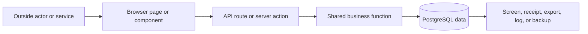

## 1. Complete Outside And Inside System Interaction

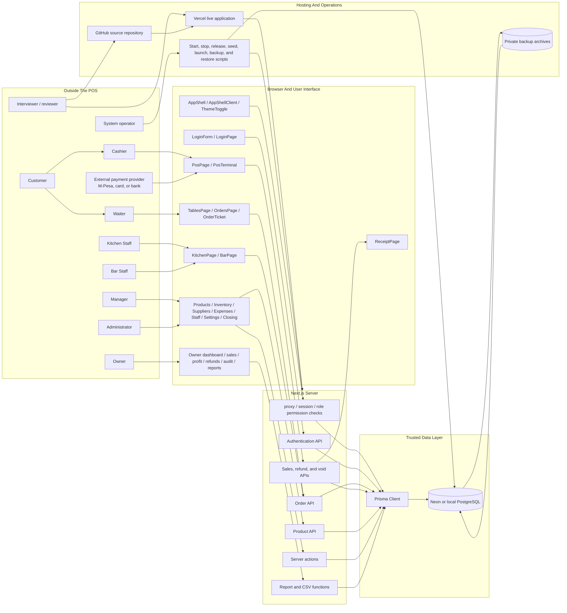

## 2. Every Request And Data Transfer

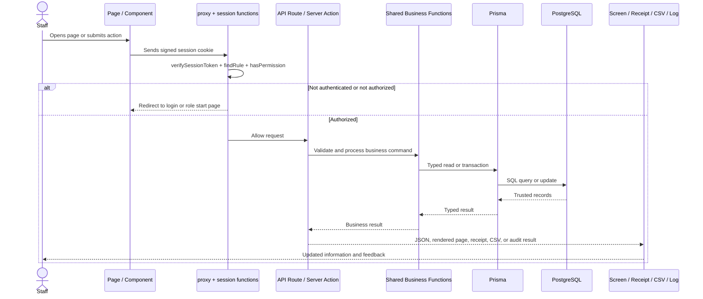

## 3. Page And Reusable Interface Functions

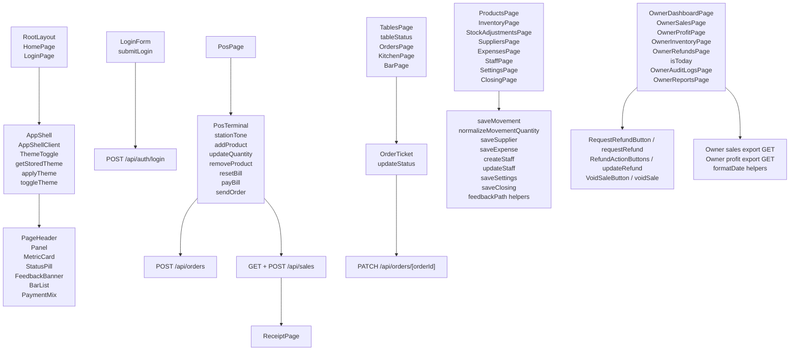

## 4. Authentication, Session, Role, And Security Functions

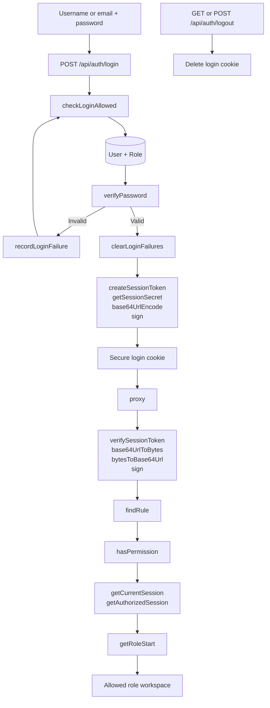

## 5. Order Creation And Preparation Functions

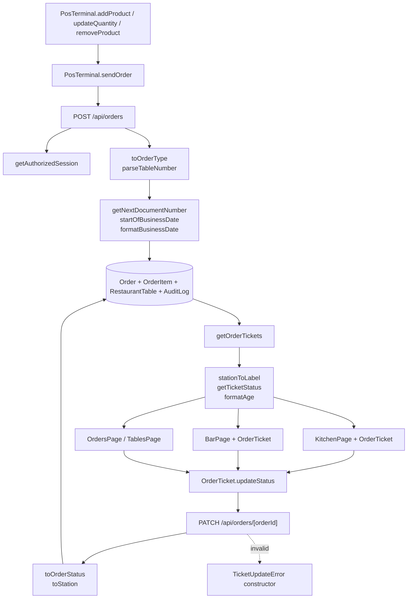

## 6. Payment, Sale, Receipt, And Stock Transaction Functions

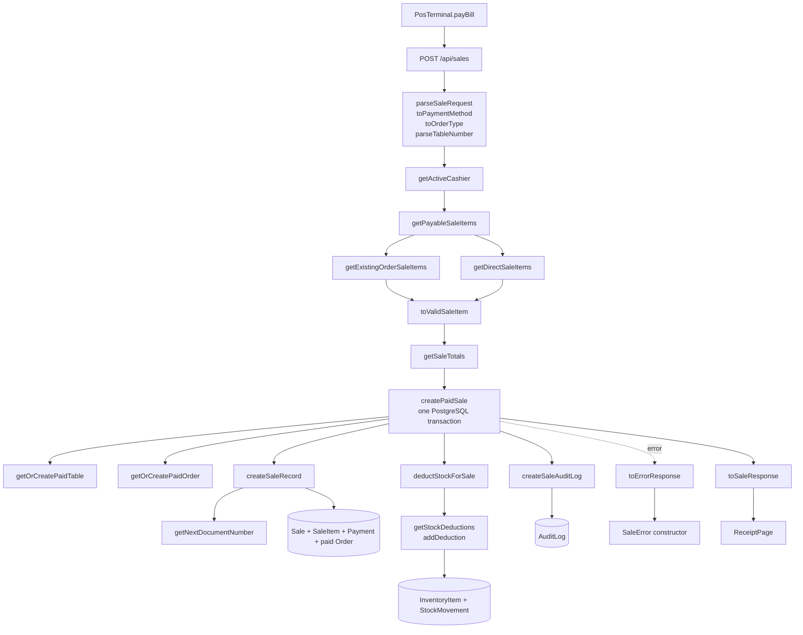

## 7. Refund, Void, Inventory, Supplier, And Expense Functions

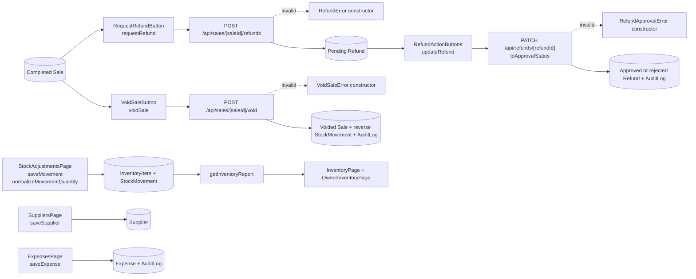

## 8. Reports, Settings, Closing, Formatting, And Shared Functions

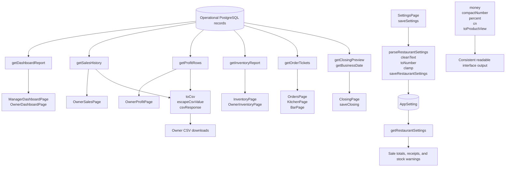

## 9. API Entry Point Map

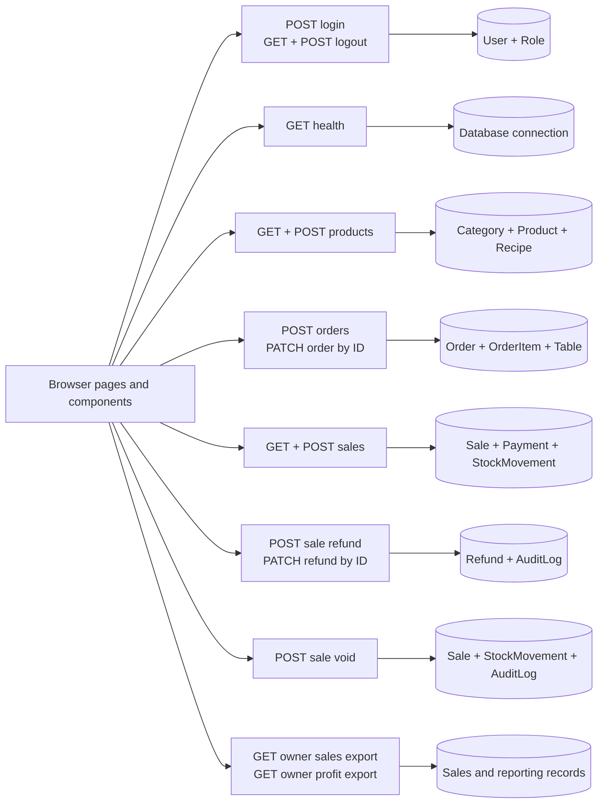

## 10. Database Model And Information Relationship Map

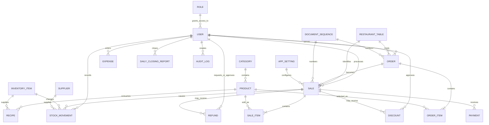

## 11. Maintenance, Deployment, Backup, And Recovery Functions

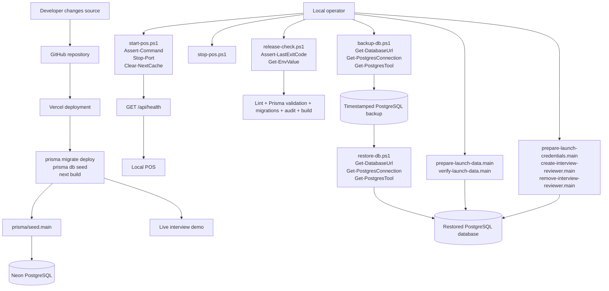

## 12. Complete Business Process From Customer Request To Closing

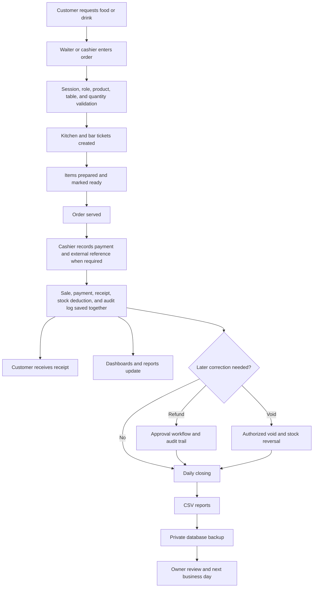

## Related Graphical Documents

- [SYSTEM GRAPHICAL PRESENTATION.html](SYSTEM%20GRAPHICAL%20PRESENTATION.html): interactive presentation for demonstrating the system
- [SYSTEM GRAPHICAL PRESENTATION PREVIEW.png](SYSTEM%20GRAPHICAL%20PRESENTATION%20PREVIEW.png): static presentation preview
- [PROJECT_FLOWCHART.md](PROJECT_FLOWCHART.md): business-process and architecture flowcharts
- [DOCUMENTATION.md](DOCUMENTATION.md): operating, setup, administration, and delivery procedures
