# Jikon Grill POS Project Flowcharts

Last updated: 10 June 2026

This document maps the architecture, role routing, restaurant workflows, inventory effects, approvals, daily closing, and production operations of the Jikon Grill POS.

The diagrams use Mermaid syntax and render in compatible Markdown viewers such as GitHub and Visual Studio Code with Mermaid support.

## 1. Complete System Flow

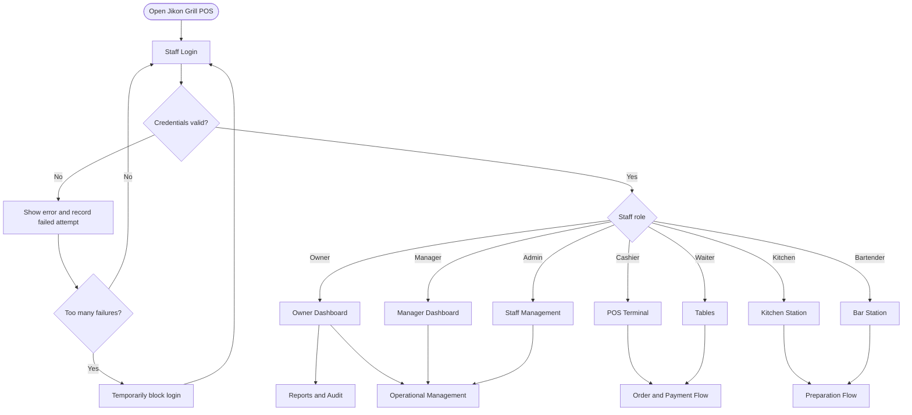

## 2. Application Architecture

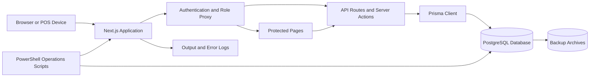

## 3. Role And Workspace Routing

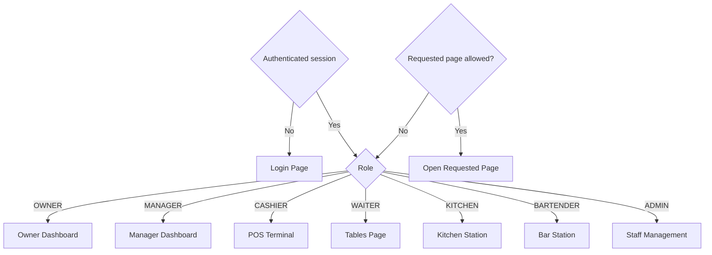

## 4. Restaurant Order Flow

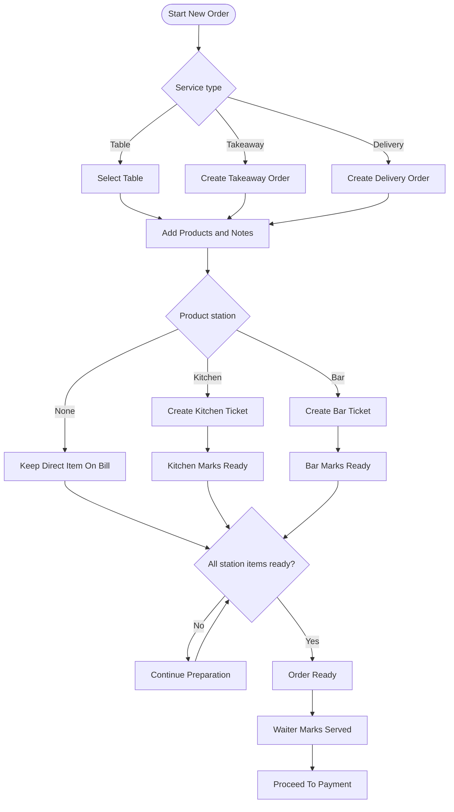

## 5. Payment And Receipt Flow

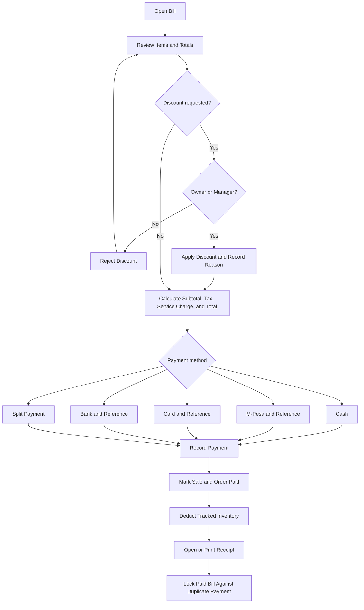

## 6. Refund And Void Flow

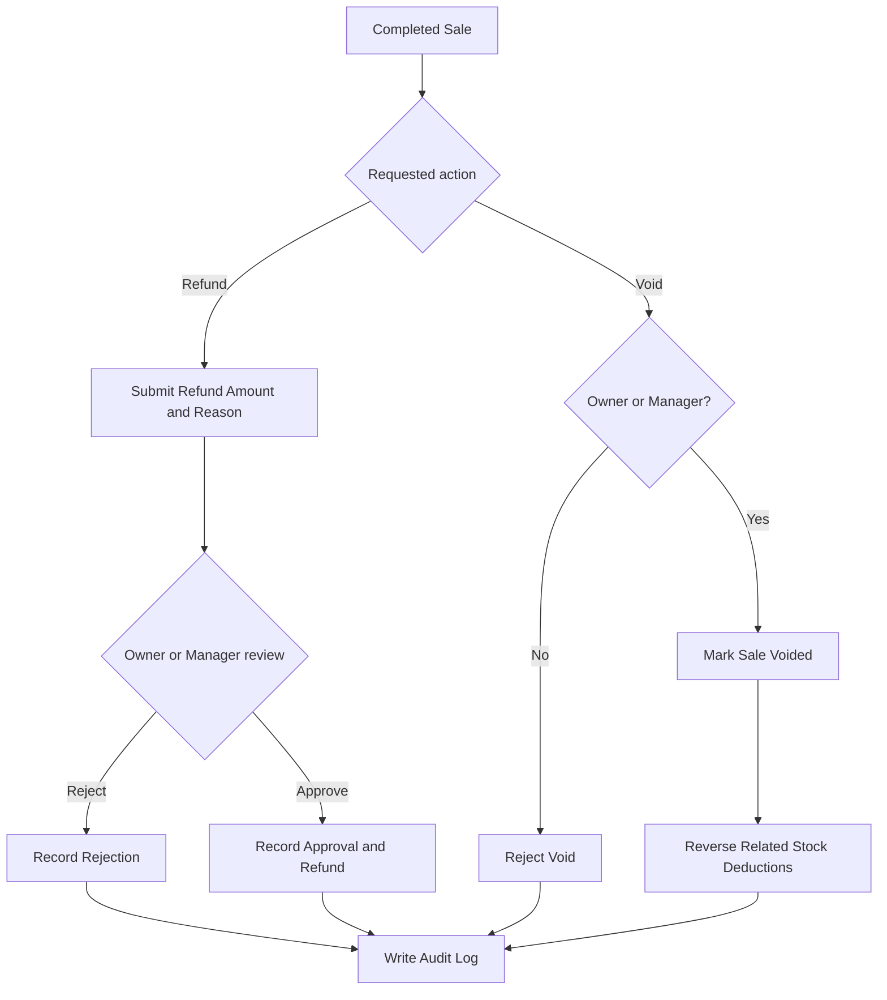

## 7. Inventory Flow

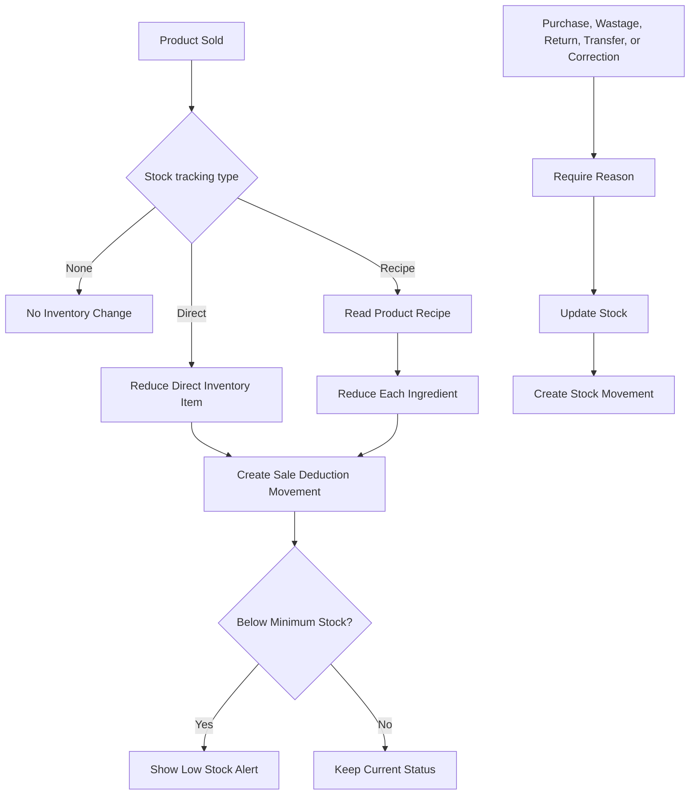

## 8. Daily Closing Flow

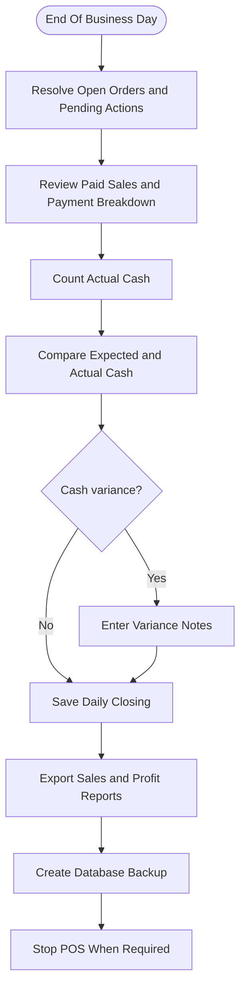

## 9. Production Start And Health Flow

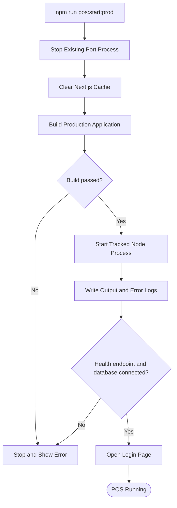

## 10. Backup And Recovery Flow

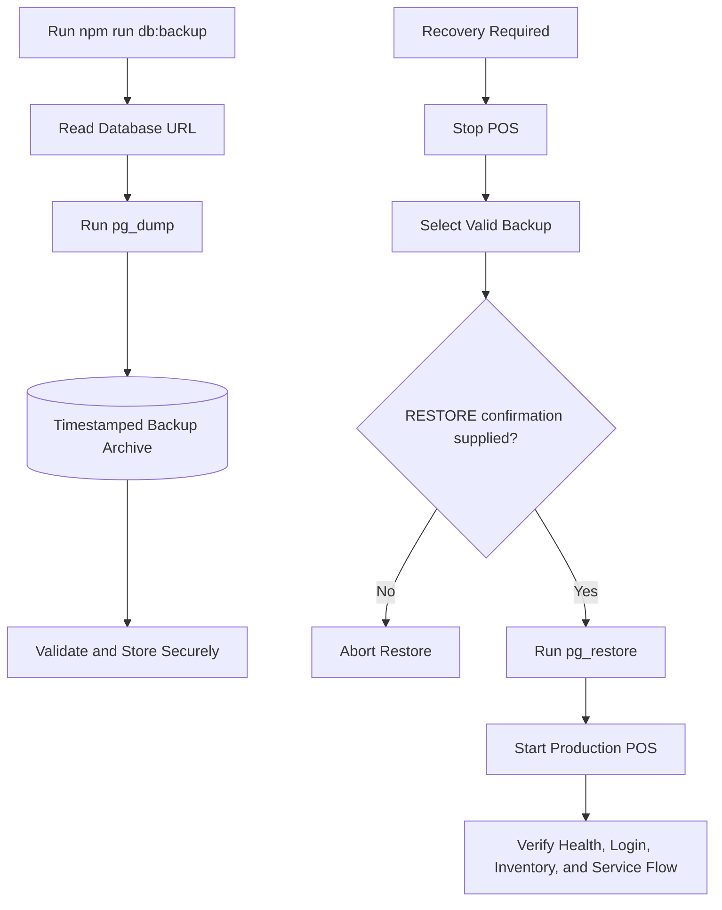

## 11. Initial Launch Preparation Flow

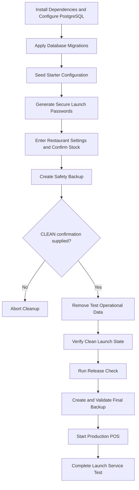

## 12. Core Data Relationship Flow

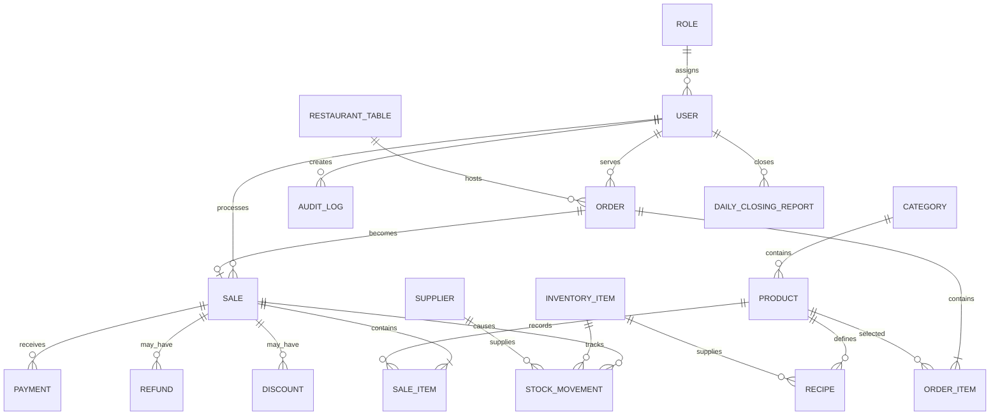

## 13. Project Route Map

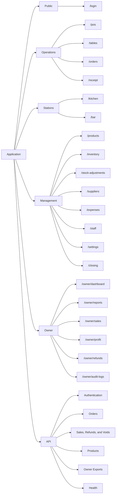

## 14. Related Documents

- [FULL SYSTEM FUNCTION AND DATA FLOWCHART.md](FULL%20SYSTEM%20FUNCTION%20AND%20DATA%20FLOWCHART.md): Complete outside-to-inside map of named functions, processes, data transfers, deployment, and operations
- [DOCUMENTATION.md](DOCUMENTATION.md): Complete operating, administration, setup, and delivery procedures
- [LAUNCH_CHECKLIST.md](LAUNCH_CHECKLIST.md): Before-opening and service-test checklist
- [README.md](README.md): Quick start and command overview
